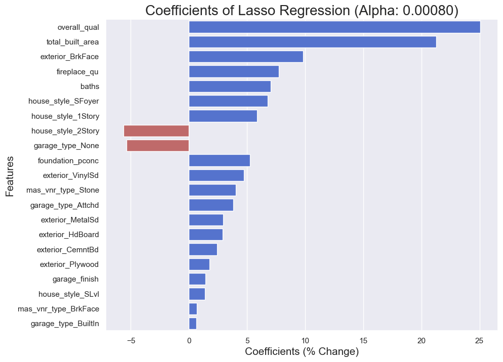

#  Project 2: Ames Housing Data and Kaggle Challenge

### Overview

`Next Realtors` is one of the top performing real estate agencies in Ames, Iowa, having been in the business for almost 20 years. The firm is well known in the local market for its top notch service and excellent follow up. However, there have been some new agencies that have claimed to be able to offer better price assessments of properties as compared to us.

### Problem Statement

The agency has thus hired a new team of data analysts to help develop a `price prediction tool` for the company. This tool should be able to predict the likely sale price of a property with `at least 80% accuracy`, and `identify prominent features` of the property that can affect the sale price.

Using this tool, our agents can then assess properties and help our clients to clinch the best deals. Home sellers can identify what type of addition or remodelling could be done to effectively boost their expected sale price, while home buyers can expect to get the best deals based on the budget they have and the type of facilities they may be expecting.

### Information

Ames is a city in Iowa, with a small population of around 66,000 as of the 2020 US Census. The city is located near the intersection of Interstate 35 and US Route 30, with a smaller highway US Route 69 passing through. With a humid continental climate, on average the warmest month is July and the coldest month is January.

Home ownership is relatively low in Ames compared to the US, with only around 41% of housing units in Ames being occupied by their owners. This is likely due to the large student population in the city. Iowa State University is home to 33,000 students as of fall 2019, which makes up approximately half of the city's entire population. Of this student population, at least 50% of the students are from outside of Iowa state and will likely either stay on campus or rent an apartment in the city.

As part of Next Realtor's renewal efforts, they have been digitalising their property transaction records, starting with the oldest records dating back to 2006. However, to date only transactions up till 2010 have been digitalised, with the remaining records expected to be complete by early 2023. The agency has provided this data from `2006 to 2010` for our initial analysis and modelling. The data includes various features and grading of the properties, including the target variable `sale price`, which we are expecting to predict, and a [data documentation](../DataDocumentation.txt) has been provided.

In order to evaluate our prediction model's performance, a section of the data provided to us has had the sale price omitted, with the actual sale prices being encoded in an online portal "Kaggle". Once we have predictions of the expected sale prices, we can submit it to this portal and it will score the accuracy of our predictions.

### Datasets

* [`train.csv`](./datasets/train.csv): Train data for preparation and training of model
* [`test.csv`](./datasets/test.csv): Test data for predictions to test model performance

#### Data Dictionary

* [Data Documentation](DataDocumentation.txt)

### Methodology

Based on the provided data from 2006 to 2010, we checked and cleaned the data to ensure it is free of missing or erroneous values. Once done, a deep dive into the dataset through exploratory data analysis was conducted to identify any trends and correlation between features and our `target variable - sale price`.

Taking care to avoid any collinearity among the selected features, we utilised 3 different regression models to attempt to predict the sale price of a property, with a dummy regressor acting as a baseline comparison.

### Key Findings

|Model|RMLSE Mean|Percentage Error|R2|
|:---|---:|---:|---:|
|Dummy|0.5897|50.49%|-0.0007|
|Linear|0.2353|17.71%|0.8396|
|**Lasso**|**0.2316**|**17.42%**|**0.8444**|
|Ridge|0.2326|17.49%|0.0.8430|

While all 3 models performed similarly, we see that the Lasso model performed the best.

Based on the chart above, we see that the overall quality of the house contributes greatly to the saleprice of a property. In fact, a single grade difference in overall quality would contribute to an almost 25% change in sale price! This would definitely be a key factor that our agents must look out for when performing any appraisals.

Some key insights:

> **For home sellers**
>
> * Fireplace quality, number of bathrooms and garage finish are features that owners could improve upon prior to sale so as to increase the potential sale price.
> * For a single grade increase in fireplace quality, we would expect at least a 5% increase in sale price
> * To maximise selling potential, agents can assess the current condition of the properties, obtain quotations from our partner contractors and present the cost-benefit analysis to our clients to determine if they would want to pay for upgrades prior to sale

> **For home buyers**
>
> * Overall quality of the house is a very important factor to assess when purchasing a home.
> * Depending on the available budget of our clients, agents can identify whether a property is potentially under or overpriced, as well as identify if there are opportunities to negotiate a better deal based on certain features of the house (or lack thereof).
> * For example, home owners on a tighter budget could consider properties without a garage, allowing them to potentially cut 5% off the price. 

### Recommendations

* **Retrain the model with newer datasets once available.** 

Due to the limitations with the currently available data, the prediction model is trained on a set of outdated information from 2006 - 2010. There would likely have various changes that have happened since, for example the availability of new building raw materials or building techniques, or maybe even demographic changes that affect the demand for housing types.  
As the remaining transactions are being digitalised, we can load the data into our model progressively and also start to identify if there may have been any trends over the years. Once all the data is complete, we can perform a final analysis and confirm the performance of our prediction model based on up-to-date information.

* **Further research into price difference between neighbourhoods** 

From our analysis, we identified that there may be missing information in our data that is unable to account for the price difference between the various neighbourhoods. While it may be common knowledge among real estate agents that properties in certain areas fetch higher prices, we will want to dive deeper into the underlying reasons in order to be able to accurately predict the expected sale price.  
If time and resources allow, we can commission a more detailed study on the respective neighbourhoods in Ames to identify if there are any other reasons that contribute to their housing sale prices.

* **Development of real-time prediction tool accessible via mobile app** 

Concurrent to the above steps, the agency can also consider engaging a software development team to build a mobile app that our agents can have access to while on the go. This would allow them to perform real-time grading and price predictions for clients once the prediction model has been refined with up-to-date data.  
As the agency seeks to expand to other cities and states in the US, the model can also be trained using data from other cities to likewise perform predictions for real estate agents stationed in those areas.
