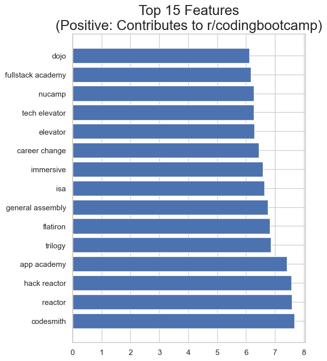
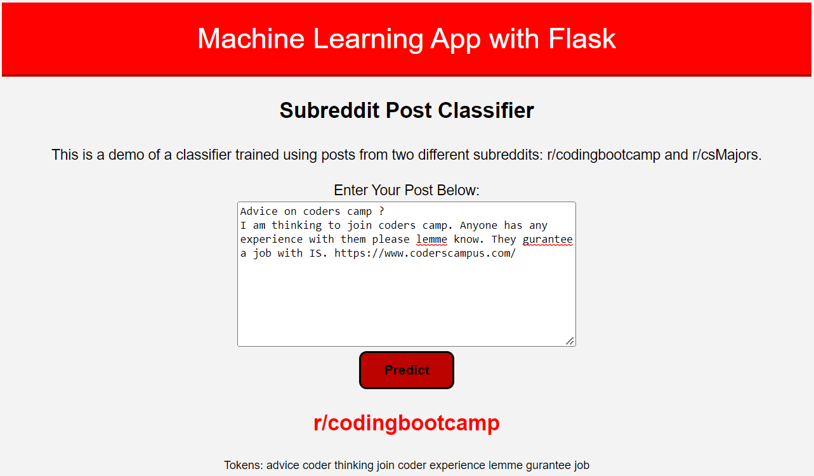

#  Project 3: Web APIs & NLP

# Problem Statement
---
General Assembly has engaged a team of data analysts to create a `classification model` that is able to `accurately identify` whether a user is likely to be interested in boot camp style learning based on `keywords` they use. 

This would allow the GA Marketing team to refine their marketing strategy based on the identified keywords, and the model may also be deployed to identify potential students.

## Introduction
General Assembly (GA) was first founded in 2011 as a co-working space in Manhattan, New York, before evolving into a private school offering courses in computer programming, data science and product management. It has expanded since and now features 6 in-person campuses across 4 continents, including Singapore.

However, GA has also seen increasing competition within the space for such coding immersive programs, or boot camps as they are more commonly known. This includes both in-person schools and also online-only programs, and if nothing is done, GA could face a decline in market share.

While it may seem intuitive that the company can just 'spam' and interact with anyone they cross paths with, the reality is that advertising costs prevent us from doing so, and it would not be efficient if we are generating too many leads for our Admissions team that ultimately are not intending to convert.

Based on the resources currently available, [Reddit.com](https://www.reddit.com) appears to be a useful source of information that we can easily gather data from. In particular, we will zoom into two popular subreddits, r/codingbootcamp and r/csMajors. Data from r/codingbootcamp would help us to train the model to identify individuals who are keen to enroll for a boot camp, while data from r/csMajors would help us to identify individuals who are looking for full length degree programs that lie outside of GA's scope. 

A successful model that is able to accurately classify a user could help to better refine our marketing efforts and streamline our resources in driving more effective conversion rates.

### Datasets

* [`records_csmajors_codingbootcamp.csv`](./data/records_csmajors_codingbootcamp.csv): Downloaded dataset for reference

# Modelling
---
As we are trying to classify reddit posts into either of two subreddits, we will be using classifier models from the sklearn library. Each classifier will be run twice, once with a Count vectorizer and once with the TF-IDF vectorizer.

- Logistic Regression
- Naive Bayes
    - Multinomial Naive Bayes
- Decision Tree
    - Random Forest Classifier 
    - Gradient Boosting Classifier
- Support Vector Model
    - Linear Support Vector Model Classifier

We expect that the `Naive Bayes` model should perform well in such a classification task. Naive Bayes models work on the basis of the [Bayes' theorem](https://en.wikipedia.org/wiki/Bayes%27_theorem), which describes the possibility of an event based on prior knowledge of conditions that might be related to our event.

We will be using `F1-score` to measure the performance of our models. F1-score ranges from 0 to 1, with 1 representing a perfect model that perfectly classifies each observation into the correct category. This metric seeks a balance between precision and recall, and in our case we also want to also minimise false negatives (codingbootcamp predicted as csMajors) so as to optimise our outreach.

The combination of `TF-IDF Vectorizer` and `Linear Support Vector Classification` appears to have the best performance with `0.919` mean train F1-score and `0.915` mean test F1-score. The `Count Vectorizer` and `Multinomial Naive Bayes` model has very similar performance, with `0.911` and `0.914` for the mean train and test F1-scores respectively.

As we are interested to identify keywords that would be helpful to our GA Marketing team, we have selected the `Multinomial Naive Bayes` model so that we can identify the features that contribute to a positive classification.

## Moving Forward

1. Due to limited resources, the current model has been trained using Reddit, which may not be very representative of our global market. The model could be further refined by expanding our dataset to cover more platforms that GA operates on, for example Instagram or Facebook, as well as across more geographical areas.
1. Through the course of our project, we have identified various acronyms and abbreviations being used on the subreddits that may not initially make sense to the layman. Better understanding and labelling of these words could allow us to better group our features and further refine our model's performance. Examples include 'OA' which is often used to mean 'Online Assessments', which are common among bootcamp admissions.
1. Sentiment analysis could be a helpful factor in identifying whether a person is favourable or against bootcamp style learning. While users may post within the subreddit, it may not always imply that they are intending to sign up for one. As such, sentiment analysis could help to refine the model by identifying those who are favourable towards bootcamps and hence enable our model to drive even better lead conversion rates.

## Recommendations

1. The identified keywords could be added to existing marketing tools that operate based on keywords. This will allow the team to more reliably identify and reach out to our intended audience.
1. Deployment of our model to support the Admissions team. The model could be used to automatically scan all of our social media interactions as well as emails, to identify target users that are more likely to convert.
1. While General Assembly appears as one of the keywords, we also see the presence of our competitors within the same list. This suggests that GA may need to double down and focus on its outreach efforts, especially with such stiff competition. In fact, users that talk about other competitors may benefit from a nudge to pull them towards GA instead. 

## Live Prediction Model
As a proof of concept, we can launch a simple demonstration using `Flask`. We will save the trained model as a .pkl file for use with our web application.

Users can type or paste a length of text and the app will analyze the text to predict which subreddit the content might belong to.

Once the [app](./app/app.py) has been launched in the terminal, we are able to type or paste a section of text in and the model will predict whether the post would classify as r/codingbootcamp or r/csMajors.

