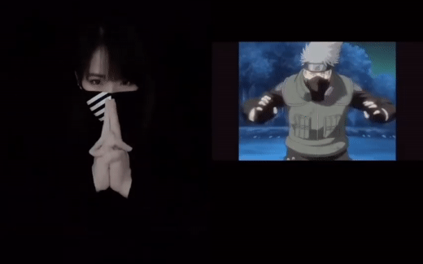

# Naruto Hand Seals - Gesture Recognition

---

Anime and manga were a big part of my daily entertainment while growing up as a 90s kid, in particular the Big 3 - One Piece, Naruto and Bleach. While One Piece still remains my personal favourite (and still ongoing as of 2023!), today's focus will be on [**Naruto**](https://naruto.fandom.com/wiki/Narutopedia), which tells the story of a young ninja called Uzumaki Naruto trying to achieve his dream of becoming the Hokage.

One of the fundamental concepts within Naruto is the use of chakra, which in turn allows a user to perform a jutsu (technique). Through the use of hand seals, a ninja can better control and manipulate their chakra when performing their technique. There are twelve basic seals, each of them named after an animal in the Chinese Zodiac. There are different sequences of hand seals for every technique, but a skilled ninja could also use less or no hand seals in order to perform a technique.

 [Source: Naruto Hand Seals by Megan #1](https://www.youtube.com/watch?v=y_NRTgVuaNo)

While I am not savvy enough to perform hand seals with the same accuracy and speed as [Megan](https://www.youtube.com/@DreamSilver05) in the image above, I wondered how the new Python and deep learning skills I've picked up recently could be applied. This is by no means an original project and I've also come across and referenced various other enthusiasts who have developed their own computer vision models. However, this is a great opportunity for me to practise using some of the various deep learning and computer vision libraries, like TensorFlow and OpenCV, that I did not have much opportunities to interact with during my Data Science Immersive.

## Problem Statement

Using `Object Detection`, we will attempt to train and deploy a model that can recognise the 12 basic hand seals in a live video feed.

## Getting Started

Referencing the [TensorFlow Object Detection Tutorial](https://tensorflow-object-detection-api-tutorial.readthedocs.io/en/latest/training.html), I will be using transfer learning from a pre-trained network to customise it to our current task.

## Collecting the Images

While I'm not the first to attempt such a project, I did not come across any existing datasets online, so this would be a great opportunity to ~~toy around~~ practise building my own dataset.

I will utilise OpenCV to capture some images of myself in various lighting conditions, as well as search online for a mixture of anime/manga and real-life samples, which should hopefully provide more generalisability to the model. We will target for approximately 200 samples per hand seal, which can then be split into our train and validation sets.

## Annotation with LabelImg

Using LabelImg, I went through the various images and annotated them to define the bounding boxes and labels that our model will eventually learn to recognise. 

During the first attempt to train the model, the model was not able to perform very effectively. After some evaluation of my workflow, I realised that my bounding boxes were not tight enough and I was leaving too much empty space. Since I am more concerned with trying to recognise the type of hand seal rather than trying to create an accurate bounding box on screen, I opted to "zoom in" to the key features of each hand seal to hopefully help the model perform better.
